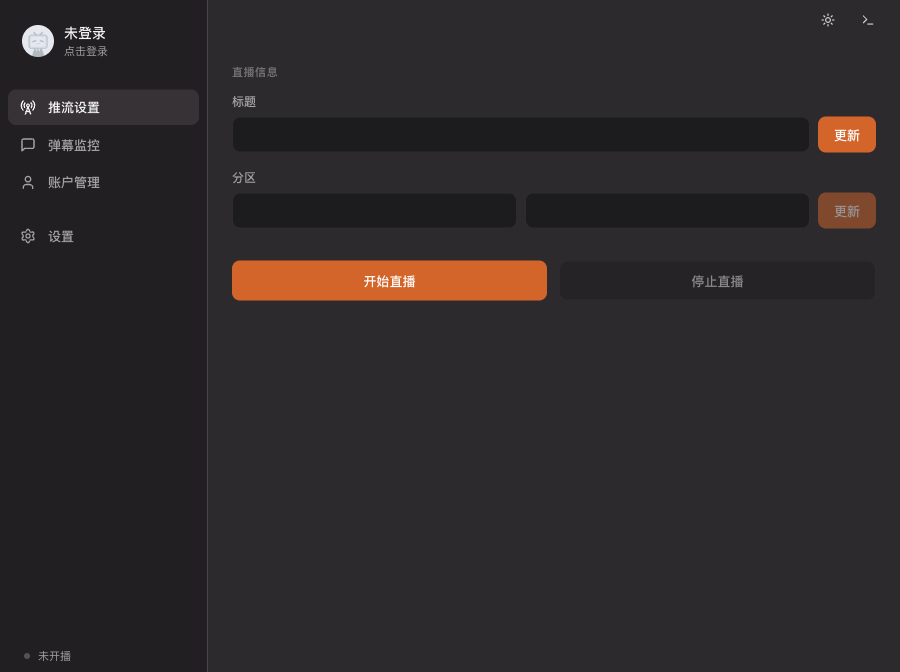

简体中文 | [English](README_EN.md)

# 哔哩哔哩直播工具

基于 [Tauri](https://tauri.app/) 重构的 B 站第三方直播推流工具，支持扫码登录、获取推流码、弹幕监控与发送。



## 功能

1. 扫码登录 B 站账号，支持多账号切换；
2. 获取第三方推流码（RTMP / SRT），可直接在 OBS 等软件中直播；
3. 支持开播时设置标题与分区；
4. 弹幕监控（含弹幕、进场、礼物消息）以及发送弹幕；
5. 系统托盘与关闭到托盘；
6. 跟随系统的深色/浅色主题。

## 技术栈

- **桌面框架**: Tauri 2.x (Rust)
- **前端**: React 18 + TypeScript + Vite + Tailwind CSS
- **后端**: Rust (Tokio async runtime)
- **目标平台**: macOS / Windows / Linux

## 下载安装

### macOS

1. 前往 [Releases](https://github.com/Zeppelinpp/bilibili-streamer/releases/latest) 页面下载最新版 `.dmg`；
2. 双击打开 `.dmg`，将 `Bilibili-Streamer.app` 拖入 **应用程序** 文件夹；
3. 首次运行时若提示"无法打开"，前往 **系统设置 → 隐私与安全性**，点击 **仍要打开**。

## 使用教程

1. 扫码登录 B 站账号；
2. 填写标题并选择分区（首次使用需要点击 `同步`）；
3. 点击 `开始直播` 来开始直播；
4. 在 **推流码** 区域复制链接和推流码至第三方推流工具；
5. 在 **弹幕** 界面可以查看并发送弹幕；
6. 点击 `停止直播` 或关闭软件来停止直播，**使用 OBS 的 `停止直播` 并不会停止直播**。

## 自行构建

### 环境要求

- **Rust**: 1.77.2+（建议通过 [rustup](https://rustup.rs/) 安装）
- **Node.js**: 18+

### 开发模式

```bash
# 安装前端依赖
npm install

# 启动 Tauri dev（同时启动 Vite dev server + Rust 编译）
npm run tauri-dev
```

### 生产构建

```bash
# 构建前端 + Rust 并打包为平台原生安装包
npm run tauri-build
```

输出产物位于 `src-tauri/target/release/bundle/`：

- **macOS**: `.dmg` / `.app`
- **Windows**: `.msi` / `.exe`
- **Linux**: `.AppImage`

## 致谢

本项目基于 [ChaceQC/bilibili_live_stream_code](https://github.com/ChaceQC/bilibili_live_stream_code) 进行重构，感谢原作者的基础实现与开源贡献。

## License

[Apache License 2.0](LICENSE.txt)
